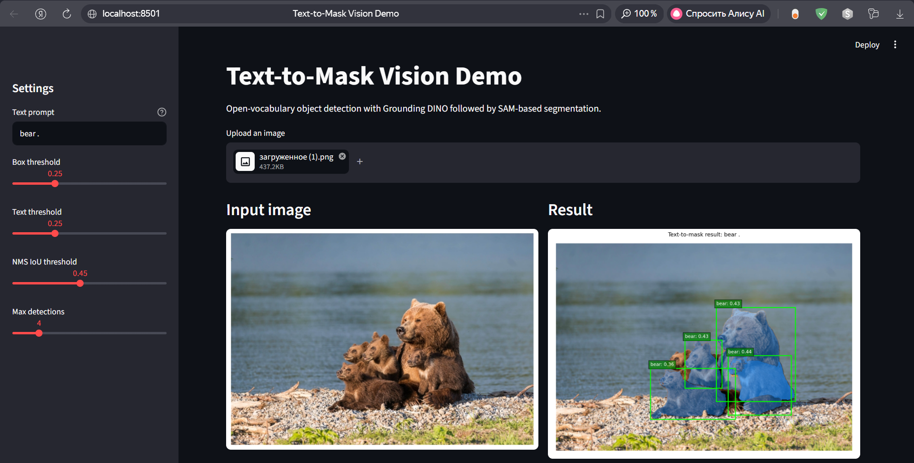
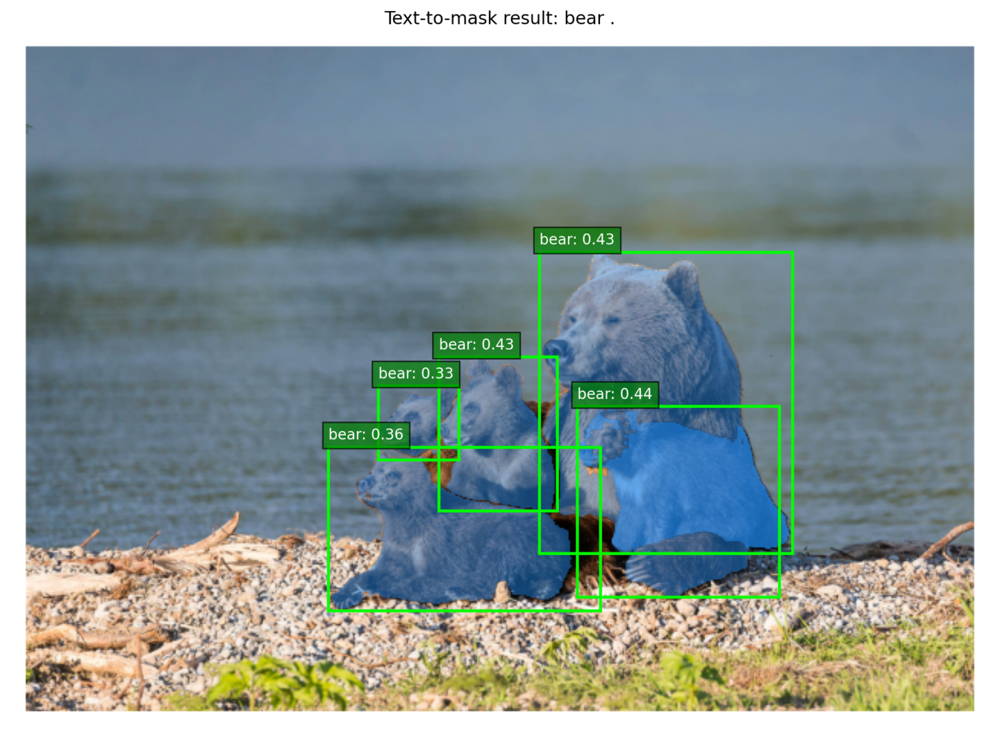
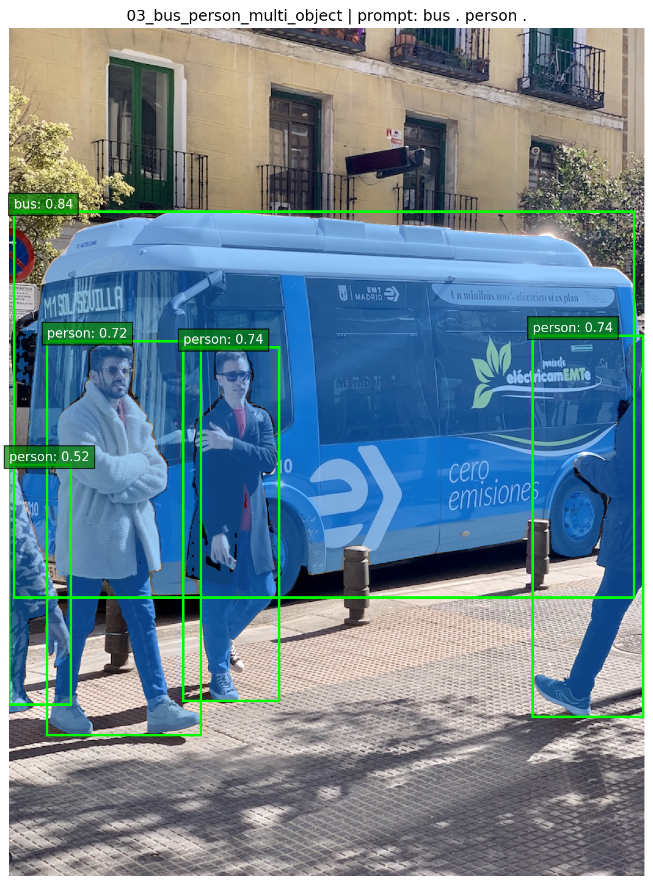
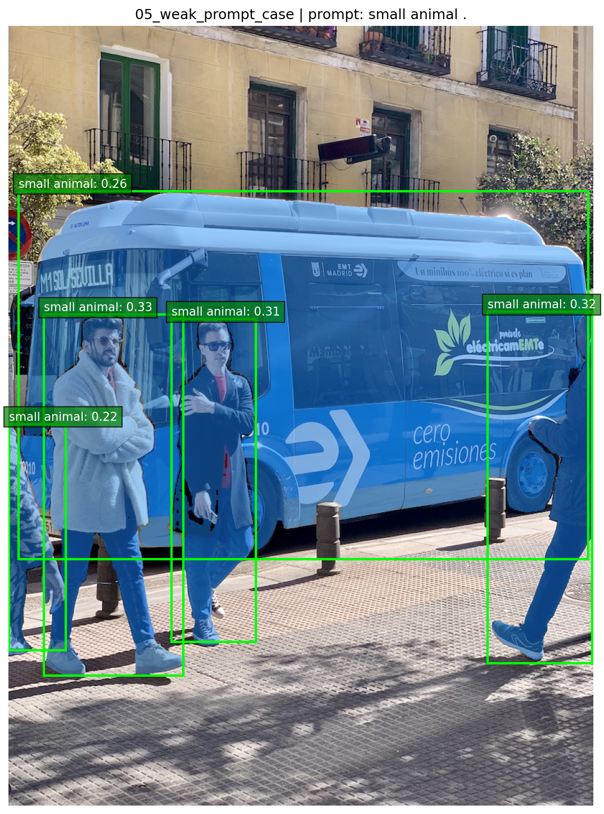

# Text-to-Mask Vision: Open-Vocabulary Object Detection and Segmentation with Grounding DINO and SAM

## 1. Introduction

This project implements a practical computer vision system for text-guided object detection and segmentation.

The main idea is simple:

```text
image + text prompt -> bounding boxes -> segmentation masks
```

The user uploads an image and provides a text prompt such as `bear .`, `person .`, or `bus . person .`. The system detects objects matching the prompt and then segments them with pixel-level masks.

The project combines two modern vision foundation models:

- Grounding DINO for open-vocabulary object detection;
- Segment Anything Model (SAM) for box-guided segmentation.

The final result is an interactive Streamlit demo and a set of reproducible Colab experiments.

## 2. Problem Statement

Classical object detection models usually work with a fixed set of classes. For example, a detector trained on COCO can detect classes such as person, car, dog, or bus, but it cannot easily generalize to arbitrary user-defined text prompts.

In contrast, open-vocabulary detection allows the user to specify objects using natural language. This makes the system more flexible and useful for practical applications such as:

- interactive image annotation;
- dataset labeling;
- visual search;
- rapid prototyping of computer vision pipelines;
- segmentation of custom objects without training a new model.

The task in this project is to build an end-to-end pipeline that takes an image and a text prompt and returns segmentation masks for the requested objects.

## 3. Project Goal

The goal of the project is to build a working prototype of a text-to-mask system.

The project focuses on:

- open-vocabulary object detection;
- text-prompted visual interaction;
- converting detected boxes into segmentation masks;
- post-processing duplicate detections with non-maximum suppression;
- qualitative evaluation on several examples;
- interactive local demo through Streamlit.

This is an inference-based project. It does not train a new model from scratch. Instead, it studies how pretrained foundation models can be combined into a practical computer vision application.

## 3.1 Review of Existing Solutions and Model Choice

Several existing approaches can be used for object detection and segmentation.

| Approach | Strengths | Limitations | Relevance to this project |
|---|---|---|---|
| Fixed-class detectors such as YOLO, Faster R-CNN, DETR | Fast and reliable for predefined categories | Require a fixed label set and often need retraining for new concepts | Not flexible enough for arbitrary text prompts |
| CLIP-based retrieval or classification | Strong image-text matching | Does not directly provide accurate object boxes or masks | Useful for semantic matching, but insufficient for this pipeline alone |
| OWL-ViT + SAM | Supports open-vocabulary detection and can be combined with SAM | Detection quality depends on prompt wording and image complexity | A reasonable alternative baseline for future comparison |
| Grounding DINO + SAM | Provides text-conditioned boxes and high-quality box-guided masks | Computationally heavy and sensitive to crowded scenes | Selected as the main approach because it directly matches the text-to-mask goal |

The final design uses Grounding DINO for open-vocabulary localization and SAM for mask generation. This choice is practical because it avoids training a new model from scratch while still supporting user-defined text prompts.

## 4. Method

The pipeline consists of four main stages.

### 4.1 Input

The input consists of:

- RGB image;
- text prompt;
- box threshold;
- text threshold;
- NMS IoU threshold;
- maximum number of detections.

Example prompt:

```text
bear .
```

Grounding DINO expects prompts to be normalized and separated with periods. For multi-object prompts, an example is:

```text
bus . person .
```

### 4.2 Open-Vocabulary Detection

Grounding DINO receives the image and text prompt and predicts bounding boxes for objects matching the prompt.

The model returns:

- bounding boxes;
- confidence scores;
- text labels.

The project uses the Hugging Face Transformers implementation:

```text
IDEA-Research/grounding-dino-base
```

### 4.3 Non-Maximum Suppression

Grounding DINO can return overlapping or duplicate boxes, especially in crowded scenes.

To reduce duplicates, the pipeline applies non-maximum suppression (NMS). NMS keeps high-confidence boxes and removes boxes that overlap too much with already selected detections.

In the experiments, the default NMS IoU threshold is:

```text
0.45
```

### 4.4 Box-to-Mask Segmentation

After detection, the selected boxes are passed to SAM.

SAM receives the image and the selected bounding boxes and generates segmentation masks. The project uses:

```text
SAM ViT-B
sam_vit_b_01ec64.pth
```

The final output includes:

- bounding boxes;
- segmentation masks;
- box scores;
- mask scores;
- visualization.

## 5. Implementation

The main implementation is located in:

```text
src/text_to_mask_pipeline.py
```

The project also includes an interactive demo:

```text
app.py
```

The Streamlit demo supports:

- image upload;
- text prompt input;
- threshold control;
- NMS IoU control;
- maximum detection control;
- result visualization;
- detections table.

The project structure is:

```text
.
├── app.py
├── README.md
├── requirements.txt
├── src/
│   └── text_to_mask_pipeline.py
├── notebooks/
│   ├── 02_colab_hf_grounding_dino_sam_sanity_check.ipynb
│   └── 03_colab_batch_gallery.ipynb
├── report/
│   ├── experiments/
│   └── figures/
└── scripts/
    └── download_sam_weights.sh
```

Large model checkpoints are not stored in Git. The SAM checkpoint is downloaded separately using:

```bash
./scripts/download_sam_weights.sh
```

## 6. Experimental Setup

The experiments were performed in two environments.

### 6.1 Google Colab

Google Colab with Tesla T4 GPU was used for the main experiments.

This environment was used for:

- model loading;
- sanity check;
- batch gallery experiment;
- result visualization;
- artifact generation.

### 6.2 Local Streamlit Demo

The local demo was tested in WSL on a local laptop.

The Streamlit interface successfully started at:

```text
localhost:8501
```

The local demo confirmed that the system is not only a notebook experiment, but also an interactive application.

CPU-only inference is possible but slower than GPU inference.

## 7. Experiments

### 7.1 Experiment 01 — Sanity Check

The first experiment verified the full pipeline on a bear image.

Prompt:

```text
bear .
```

Pipeline:

```text
image -> Grounding DINO -> NMS -> SAM -> visualization
```

The model detected several bear instances. After NMS, the selected boxes were passed to SAM, which produced segmentation masks.

This experiment confirmed that the core pipeline works end-to-end.

### 7.2 Experiment 02 — Local Streamlit Demo

The second experiment verified the interactive interface.

The Streamlit application successfully accepted an uploaded image, ran the text-to-mask pipeline, displayed the input and result images, and showed a detections table.

The detections table included:

- labels;
- box scores;
- mask scores;
- bounding box coordinates.

This experiment confirmed that the project can be demonstrated as a local web application.

### 7.3 Experiment 03 — Batch Gallery

The third experiment tested several qualitative cases.

The tested prompts were:

| Case | Prompt | Purpose |
|---|---|---|
| Crowded bears | `bear .` | crowded/failure analysis |
| Bear cub prompt | `bear cub .` | prompt sensitivity |
| Bus and people | `bus . person .` | multi-object prompt |
| Clear person case | `person .` | simple success case |
| Weak prompt case | `small animal .` | mismatched prompt / limitation |

The batch gallery generated five result images and a CSV table with detections, scores, and notes.

### 7.4 Visual Results

The following figures show representative outputs of the implemented text-to-mask pipeline.

**Local Streamlit demo.** The application accepts an uploaded image, a text prompt, and threshold settings, then displays the segmentation result and detections table.



**Crowded bears case.** This example demonstrates a difficult crowded scene with overlapping animal instances. The final tuned setting keeps five detections for the five visible bears while preserving a readable visualization. Some masks remain slightly incomplete because the objects overlap and SAM receives box-guided prompts.



**Multi-object prompt case.** The prompt `bus . person .` demonstrates that the system can process multiple open-vocabulary categories in a single image. This figure intentionally uses the same input image as the weak prompt case below, so that prompt sensitivity can be compared while keeping the image fixed.



**Weak prompt case.** The prompt `small animal .` intentionally uses the same bus image as the multi-object case. The resulting detections show that a mismatched prompt can produce semantically incorrect or less meaningful detections even when SAM still generates masks for the detected boxes.



## 8. Results

The project successfully demonstrates an end-to-end open-vocabulary text-to-mask pipeline.

The strongest results are observed when:

- the target object is clearly visible;
- the prompt is simple and specific;
- objects do not heavily overlap;
- the image contains common visual categories.

The system also works for multi-object prompts such as:

```text
bus . person .
```

In these cases, the detector can identify multiple object categories and SAM can generate masks for the detected boxes.

### 8.1 Quantitative Proxy Summary

Because the project is a practical inference-based prototype rather than a supervised benchmark study, evaluation is based on qualitative examples and proxy metrics extracted from the batch gallery experiment.

| Case | Raw detections | After NMS | Mean box score | Mean mask score | Interpretation |
|---|---:|---:|---:|---:|---|
| `01_crowded_bears` | 8 | 5 | 0.399 | 0.971 | Crowded scene; tuned setting keeps five final detections while preserving a readable visualization. |
| `02_bear_cub_prompt` | 5 | 4 | 0.425 | 0.958 | Same image with a more specific prompt; useful for prompt sensitivity. |
| `03_bus_person_multi_object` | 5 | 5 | 0.709 | 0.962 | Successful multi-object prompt with bus and person categories. |
| `04_person_clear_case` | 2 | 2 | 0.654 | 0.987 | Clear simple case with stable person detections. |
| `05_weak_prompt_case` | 5 | 5 | 0.286 | 0.961 | Mismatched prompt; lower box scores show semantic uncertainty. |

The weak prompt case intentionally uses the same bus image as the multi-object prompt case. This creates a controlled comparison: the image remains fixed, while the text prompt changes from a semantically correct prompt (`bus . person .`) to a mismatched prompt (`small animal .`). The lower mean box confidence in the weak prompt case supports the prompt-sensitivity analysis.

The crowded bears case is also intentionally included as a limitation example. The final tuned setting keeps five detections for the five visible bears (`box_threshold=0.25`, `text_threshold=0.30`, `nms_iou_threshold=0.35`, `max_detections=8`). Some masks remain slightly incomplete because nearby bear instances overlap strongly and the pipeline relies on box-guided segmentation.

## 9. Error Analysis

The main observed limitations are related to crowded scenes, prompt sensitivity, and object ambiguity.

### 9.1 Crowded Scenes

In the bear example, several animals are visually close to each other and partially overlapping. Grounding DINO returns multiple boxes, some of which overlap. NMS reduces duplicates, but it can also suppress close valid detections.

This is a common trade-off:

- weak NMS keeps duplicates;
- strong NMS may remove real nearby objects.

### 9.2 Partial Masks

SAM generates masks based on the boxes provided by the detector. If the box is inaccurate or covers only part of an object, the mask can also be partial.

This means that segmentation quality depends strongly on detection quality.

### 9.3 Prompt Sensitivity

Changing the prompt changes the detections.

For example:

```text
bear .
```

and

```text
bear cub .
```

can produce different detection behavior on the same image.

This shows that open-vocabulary systems are flexible, but users need to choose prompts carefully.

### 9.4 Weak or Mismatched Prompts

The weak prompt case demonstrates that the model may produce low-quality detections or no meaningful detections when the prompt does not match the image content.

This is important for practical usage: open-vocabulary does not mean arbitrary prompts always work.

## 10. Demo

The project includes a Streamlit demo.

Run:

```bash
python -m streamlit run app.py
```

Before running the demo, the SAM checkpoint should be downloaded:

```bash
./scripts/download_sam_weights.sh
```

The demo allows the user to:

- upload an image;
- write a text prompt;
- adjust thresholds;
- run the pipeline;
- inspect the visualization and detections table.

## 11. Discussion

The project shows that modern pretrained foundation models can be combined into a useful computer vision application without additional training.

The main advantage of the approach is flexibility. A user can request objects through text prompts rather than being limited to a fixed class list.

However, the approach also has limitations:

- inference is computationally heavy;
- CPU inference is slow;
- results depend on prompt wording;
- crowded scenes are difficult;
- detection errors propagate to segmentation.

Despite these limitations, the system is practical for interactive annotation, prototyping, and qualitative analysis.

## 12. Future Work

Possible future improvements include:

- adding more test images;
- comparing Grounding DINO with OWL-ViT;
- measuring latency on CPU and GPU;
- adding a batch inference mode to the Streamlit app;
- exporting masks as PNG or COCO annotations;
- adding mask editing tools;
- deploying the demo on a GPU-enabled server;
- adding quantitative evaluation on a labeled dataset.

## 13. Conclusion

This project implemented a working text-to-mask computer vision system using Grounding DINO and SAM.

The final system includes:

- reusable inference pipeline;
- Colab sanity check;
- batch gallery experiment;
- local Streamlit demo;
- experiment logs;
- result visualizations;
- qualitative error analysis.

The project demonstrates how open-vocabulary detection and segmentation can be combined into an interactive application for prompt-based visual understanding.
